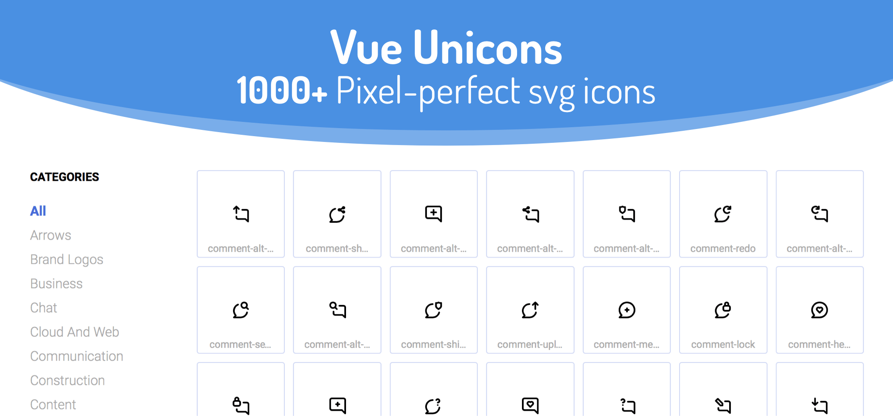
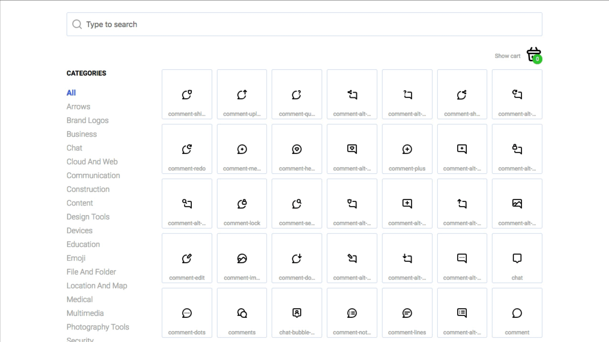

<p align="center">
  
  
  
  
  
</p>



1000+ Pixel-perfect svg [unicons](https://github.com/iconscout/unicons) for your next project as Vue components

## Supporting

Vue Unicons is open source project and completely free to use.

If you like the project, you can donate to support the development via the following methods:


<div align="center">

[](https://www.patreon.com/antonreshetov)
[](https://paypal.me/antonreshetov)
[](https://blockchain.com/btc/payment_request?address=1GnNU7UGrXyKx5Zd3uDfhCLL716AYBJwAJ&amount=0.00010450&message=Contribution%20to%20massCode)

</div>

## Demo

[https://antonreshetov.github.io/vue-unicons](https://antonreshetov.github.io/vue-unicons/)

## Developed with love for developers

A simple way to add the necessary icons and install them.



## Install

### NPM

Installing with npm is recommended and it works seamlessly with webpack.

```js
npm i vue-unicons
```

### Download

You can download latest version from the Github: [Download](https://github.com/antonreshetov/vue-unicons)

## Quick start

### Global

To use in your project:

1. Import vue-unicons
2. Grab the icons you want and add then into Unicon library
3. Install Unicon into Vue

`main.js`

**Vue 3**

```js
import { createApp } from 'vue'
import App from './App.vue'
import Unicon from 'vue-unicons'
import { uniLayerGroupMonochrome, uniCarWash } from 'vue-unicons/dist/icons'

Unicon.add([uniLayerGroupMonochrome, uniCarWash])

createApp(App).use(Unicon).mount('#app')
```

**Vue 2**

```js
import Vue from 'vue'
import App from './App.vue'
import Unicon from 'vue-unicons/dist/vue-unicons-vue2.umd'
import { uniLayerGroupMonochrome, uniCarWash } from 'vue-unicons/dist/icons'

Unicon.add([uniLayerGroupMonochrome, uniCarWash])
Vue.use(Unicon)

new Vue({
  render: h => h(App)
}).$mount('#app')
```

`App.vue`

> Use the name of icon without the uni prefix, icon style and in the kebab-case: <br>
> `uniCarWash` -> `car-wash`<br>
> `uniLayerGroupMonochrome` -> `layer-group`

```html
<template>
  <div>
    <unicon name="car-wash" fill="limegreen"></unicon>
    <unicon name="layer-group" fill="royalblue" icon-style="monochrome"></unicon>
  </div>
</template>
```

### Config

You can configure the icons globally. Simply specify the required parameters during installation.

```js
...
createApp(App)
  .use(Unicon, {
    fill: 'deeppink',
    height: 32,
    width: 32
  })
  .mount('#app')
```

## Add custom icons

No icons you need? No problem, you can add custom svg icons.

`custom-icons.js`

```js
// Always use a prefix to avoid coincidence with existing icons.
export const myCustomIcon = {
  name: 'my-custom-icon',
  style: 'line',
  path: '<path d="M16.327 10.775a.312.312 0 0...</path>' // Copy everything inside the svg tag of the icon you want and past there
}
```

>For correct positioning of svg icon please make sure that the icon to be added has `viewBox="0 0 X X"`

`main.js`

```js
import { createApp } from 'vue'
import App from './App.vue'
import Unicon from 'vue-unicons'
import { uniLayerGroupMonochrome, uniCarWash } from 'vue-unicons/dist/icons'
import { myCustomIcon } from './custom-icons'

Unicon.add([uniLayerGroupMonochrome, uniCarWash, myCustomIcon])

createApp(App).use(Unicon).mount('#app')
```

`App.vue`

```html
<template>
  <div>
    <unicon name="constructor" fill="royalblue"></unicon>
    <unicon name="car-wash" fill="limegreen"></unicon>
    <unicon name="my-custom-icon" fill="royalblue" />
  </div>
</template>
```

[See example](https://codesandbox.io/s/vue-template-t8y1l)

## Nuxt

Installation in Nuxt is almost the same, except that you need to create a separate file in the `plugins` folder:

`plugins/vue-unicons.js`

```js
import Vue from 'vue'
import Unicon from 'vue-unicons/dist/vue-unicons-vue2.umd'
import { uniLayerGroupMonochrome, uniCarWash } from 'vue-unicons/dist/icons'

Unicon.add([uniLayerGroupMonochrome, uniCarWash])
Vue.use(Unicon)
```

Then we add the file path inside the plugins key in `nuxt.config.js`, and set `mode: 'client'` to make vue-unicons work only in a browser.

```js
  ...
  plugins: [
    { src: '~/plugins/vue-unicons', mode: 'client' }
  ]
  ...
```

```html
<template>
  <div>
    <client-only>
      <unicon name="car-wash" fill="limegreen"></unicon>
      <unicon name="layer-group" fill="royalblue" icon-style="monochrome"></unicon>
    </client-only>
  </div>
</template>
```

## Props

|     Name     |    Description     |   Type   |  Accepted values  | Default value |
| ------------ | ------------------ | -------- | ----------------- | ------------- |
| `name`       | Icon name          | `string` | -                 | -             |
| `width`      | Width of icon      | `string` | -                 | -             |
| `height`     | Height of icon     | `string` | -                 | -             |
| `fill`       | Fill color of icon | `string` | HEX or color name | -             |
| `hover-fill` | Fill color on hover| `string` | HEX or color name | -             |
| `icon-style` | Icon style         | `string` | line / monochrome | line          |

## Events

|  Name   |           Description           | Payload |
| ------- | ------------------------------- | ------- |
| `click` | Triggered when icon was clicked | -       |

## License

Vue Unicons licensed under MIT.

[Unicons](https://github.com/iconscout/unicons) licensed under Apache 2.0
